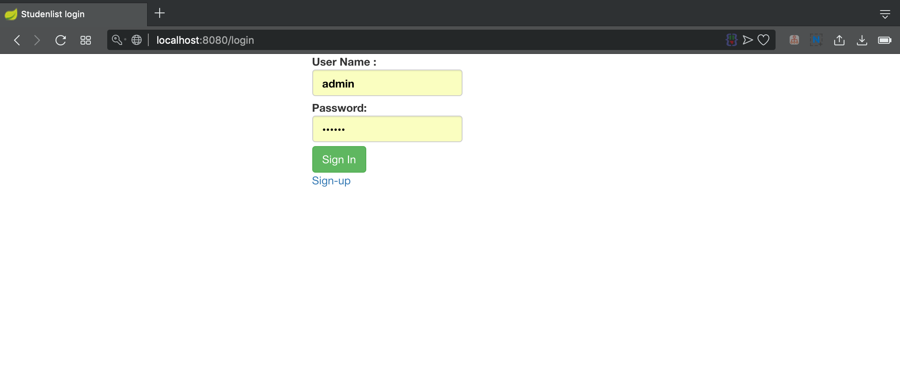
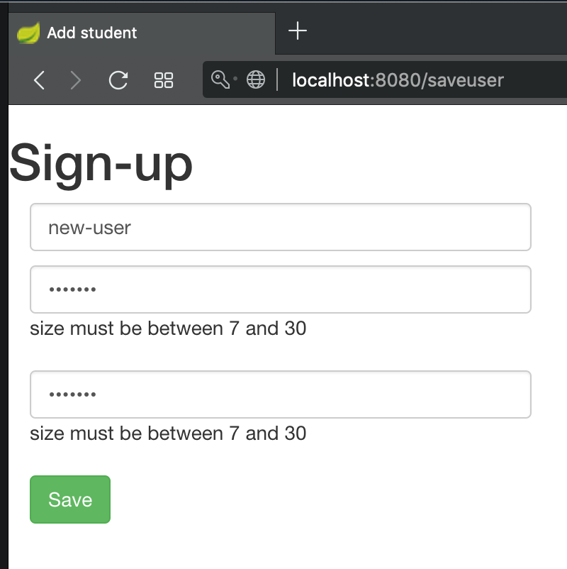
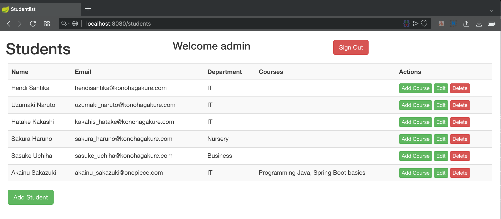
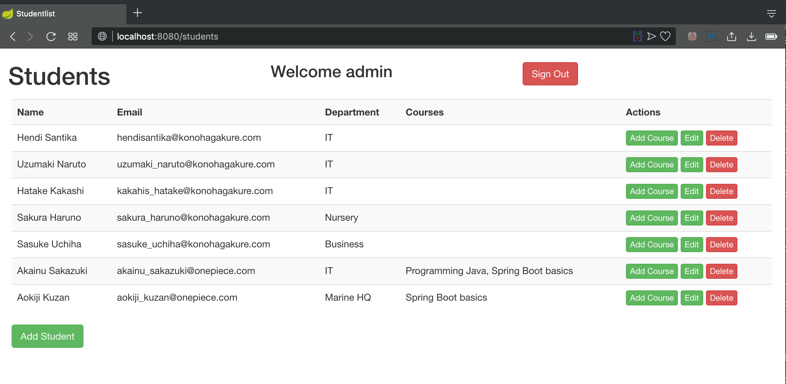
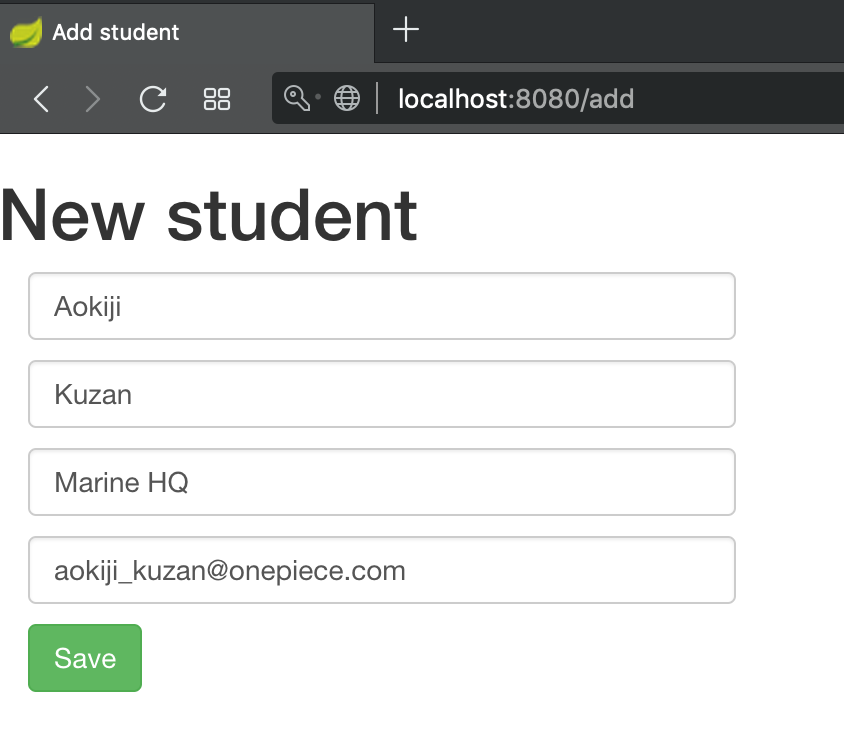
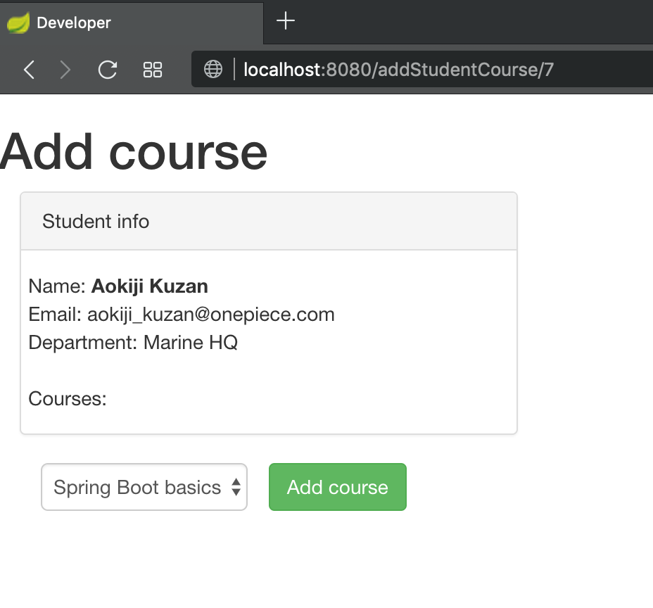
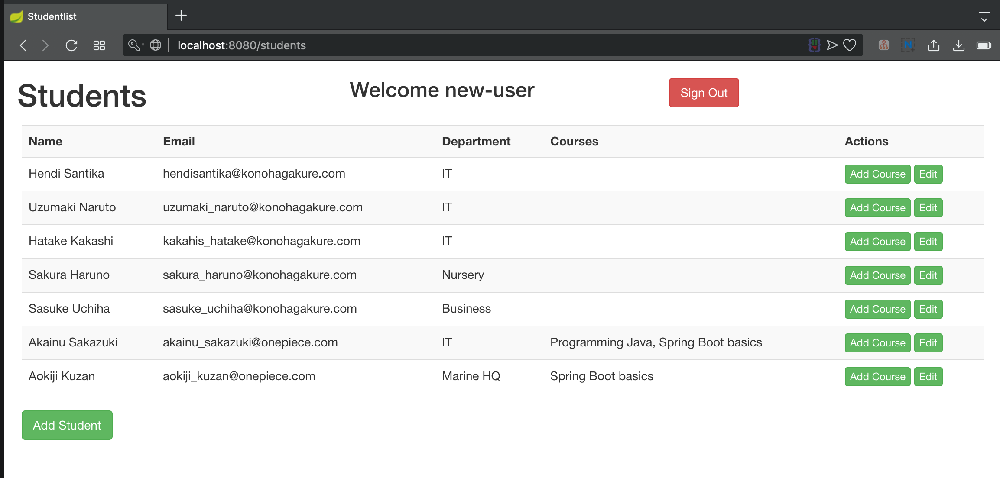

# StudentList
Simple CRUD application made with Spring Boot

- Spring Boot
- Thymeleaf
- H2 database
- Bootstrap

Usage (with eclipse):

1.) Clone the project `https://github.com/hendisantika/StudentListFinal.git`

2.) Eclipse: File -> Import -> Maven -> Existing Maven Projects

3.) Run by this command : `mvn clean spring-boot:run`

4.) Navigate to http://localhost:8080/students

Application has two demo users: 

user/user (role=USER) and

admin/admin (role=ADMIN)

## Screenshot

Login Page

Sign Up

Admin Page

Admin Page

Add New Student Page

Add New Student Course

User Page

